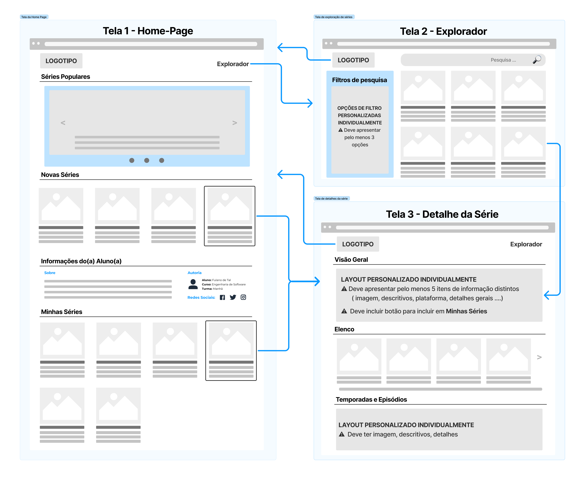

# Projeto de Apresentação de Séries Responsivo

## Descrição

Este projeto é um site de apresentação de séries, desenvolvido com HTML, CSS, Bootstrap, e integração com a API **The Movie Database**. O site exibe séries com suas informações, temporadas, episódios, e permite ao usuário explorar detalhes de cada série. O projeto foi realizado como parte de um trabalho da faculdade, na disciplina de **Desenvolvimento de Interfaces Web**.


## Tecnologias Utilizadas

- **HTML**: Estruturação do conteúdo da página.
- **CSS**: Estilização do site, incluindo layout e responsividade.
- **Bootstrap**: Utilizado para estilização e responsividade, facilitando a construção de componentes como botões, cards, acordeões, etc.
- **FontAwesomeIcons**: Para ícones customizados.
- **Flexbox**: Utilizado para criar layouts flexíveis e alinhamento de elementos.
- **Grid**: Aplicado para organizar o conteúdo em grades, facilitando a exibição de séries e episódios.
- **The Movie Database API**: Para puxar os dados dinâmicos das séries, substituindo conteúdo estático por informações reais e atualizadas.
- **JSON Server**: Para simular uma API REST, permitindo a utilização de dados locais.

## Estrutura do Projeto

- **index.html**: Página inicial que contém a apresentação das séries, incluindo informações como elenco, temporadas, episódios e botões de interação.
- **explorer.html**: Página para utilizar filtros e pesquisar entre as diversas séries.
- **serie.html**: Apenas um template para as futuras séries que terão no sistema, apresenta todos os detalhes sobre a série, elenco, episódios e temporadas.



### Principais Componentes:

1. **Cabeçalho**: Contém o nome do site e uma barra de navegação com links para o "Início" e o "Explorador".
2. **Seção "Populares"**: Por meio de um "carrossel" de imagens, apresenta banners de algumas séries populares.
3. **Seção "Novidades"**: Apresenta algumas séries que foram adicionadas recentemente.
4. **Seção "Informações do Aluno"**: Apresenta algumas informações minhas, feita de acordo com o wireframe disponibilizado.
5. **Elenco**: Na página de detalhes da série, pode ser visualizado uma parte do elenco da mesma.
6. **Acordeão de Temporadas**: Implementado para cada série, exibindo suas respectivas temporadas e episódios com descrições e botões para assistir.
7. **Barra de Pesquisa**: Permite aos usuários pesquisar por séries específicas.
8. **Filtros de Pesquisa**: Permite aos usuários filtrar séries por meio de alguns filtros pré-definidos, como idioma, gênero, avaliação e elenco.
9. **Sistema de Avaliações**: Nos cards de cada série há um trecho apresentado por uma "barra de progresso de estrelas", indicando a porcentagem atual de avaliações.
10. **Categorias**: Utilizado o sistema de badges do Bootstrap para indicar as categorias das séries.
11. **Favoritar**: Um sistema para favoritar séries, e essas serem apresentadas na seção de "Minhas Séries" no Início.

## Como Executar o Projeto

1. **Clone o repositório ou faça o download do projeto**.
2. **Instale as dependências**:
   - Certifique-se de que o **Node.js** está instalado no seu computador.
   - Abra o terminal na pasta do projeto e execute o comando:
     ```bash
     npm install
     ```
3. **Inicie o servidor local**:
   - Depois que as dependências forem instaladas, execute o comando:
     ```bash
     npm start
     ```
   - O site ficará disponível em [http://localhost:3000](http://localhost:3000).

4. **Explore o site** e veja as informações dinâmicas sobre as séries, puxadas da API **The Movie Database**.

## Conclusão

Este projeto é um site simples, mas poderoso, de apresentação de séries, utilizando tecnologias modernas como Bootstrap para garantir uma experiência fluida em qualquer dispositivo. Ele agora está completamente funcional, com integração com a API **The Movie Database**, garantindo dados atualizados e dinâmicos.

Meu GitHub: [Eman134](https://github.com/Eman134)
